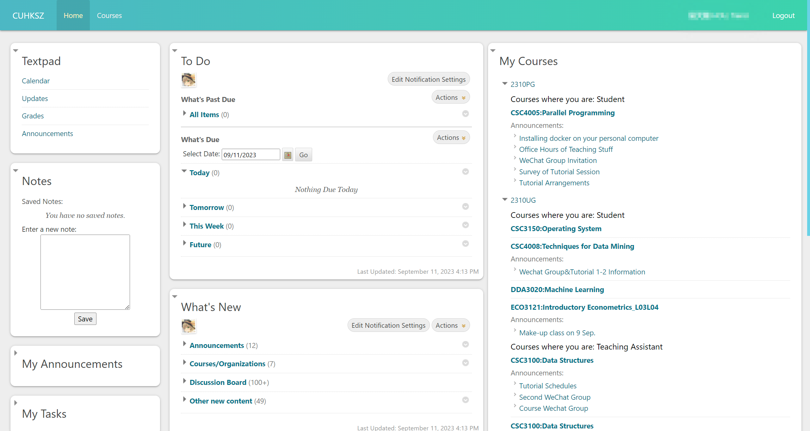
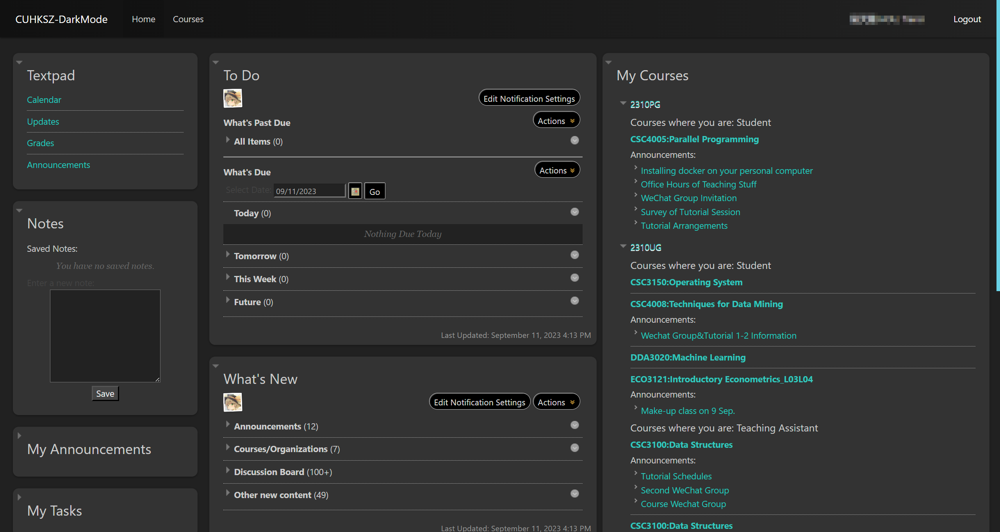

# oh-my-blackboard
## Introduction

Blackboard custom themes mainly for The Chinese University of Hong Kong, Shenzhen

## How to install

We provide two different way to install the oh-my-blackboard. 

- [Stylus](https://github.com/openstyles/stylus) ([Chrome Extension](https://chrome.google.com/webstore/detail/stylus/clngdbkpkpeebahjckkjfobafhncgmne) or [FireFox add-ons](https://addons.mozilla.org/zh-CN/firefox/addon/styl-us/))

- [Tampermonkey](https://www.tampermonkey.net/)

## List of themes

| Name       | Preview                           | Stylus                                                       | Tampermonkey             |
| ---------- | --------------------------------- | ------------------------------------------------------------ | ------------------------ |
| Argon      |       | [Install](https://userstyles.world/style/12010/oh-my-blackboard-argon-theme) | [Install via Jsdelivr](https://cdn.jsdelivr.net/gh/enderturtleOrz/oh-my-blackboard/Argon/Argon.user.js) |
| Argon-dark |  | [Install](https://userstyles.world/style/12011/oh-my-blackboard-argon-dark-theme) | [Install via Jsdelivr](https://cdn.jsdelivr.net/gh/enderturtleOrz/oh-my-blackboard/Argon-dark/Argon-dark.user.js) |

